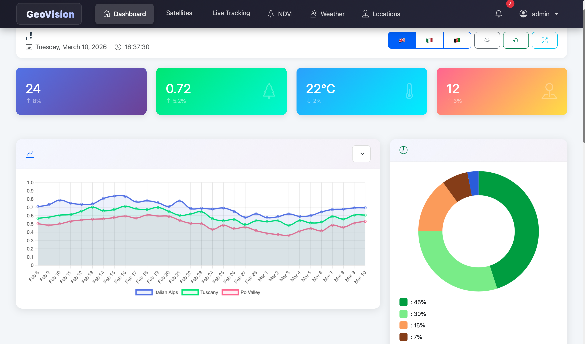
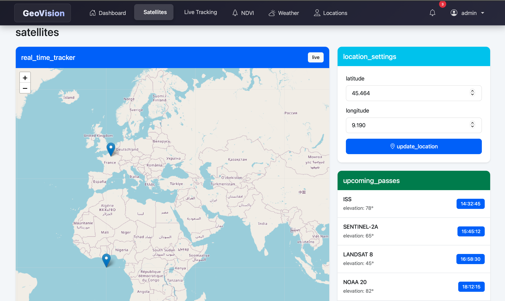
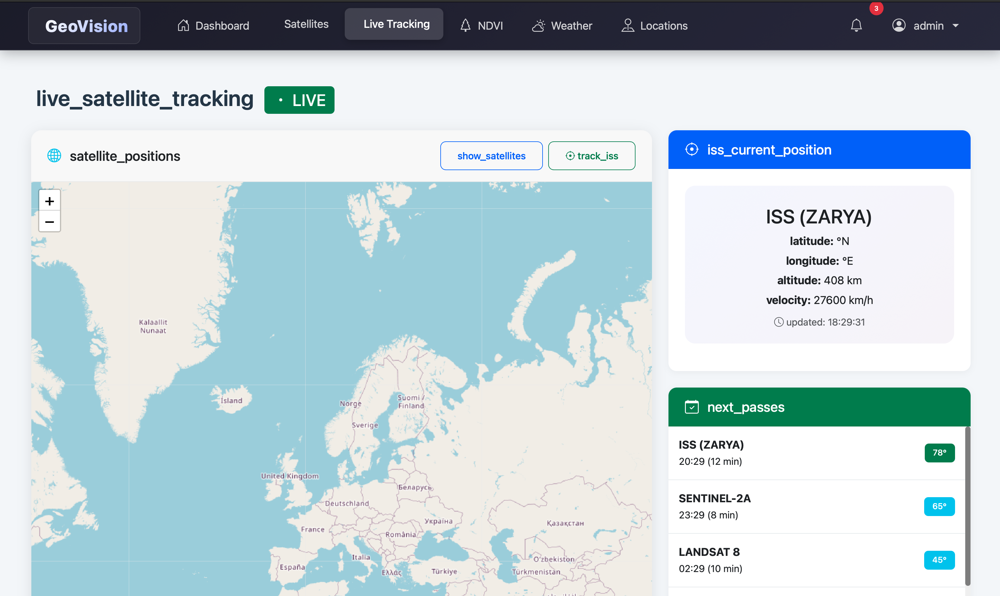
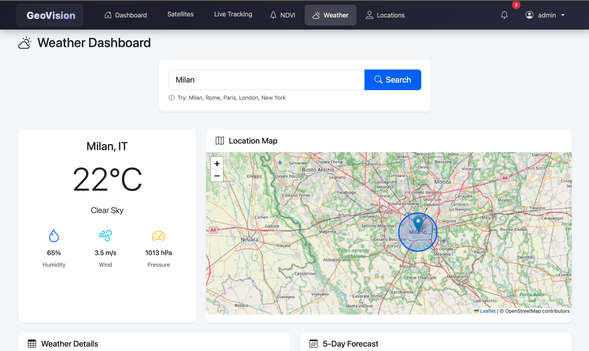
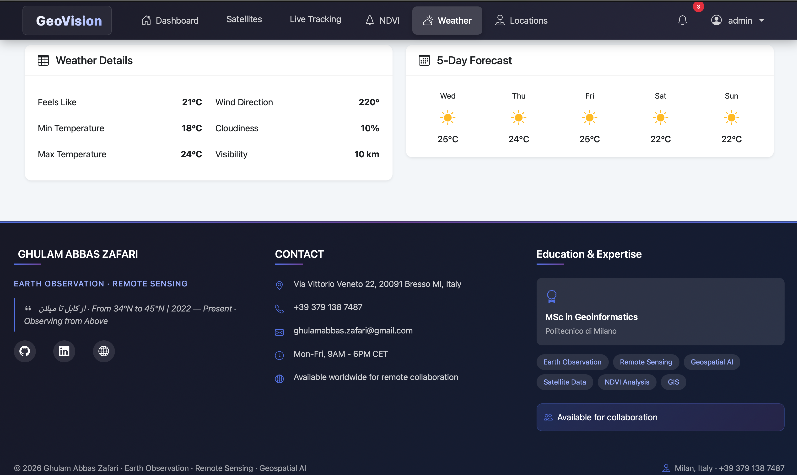
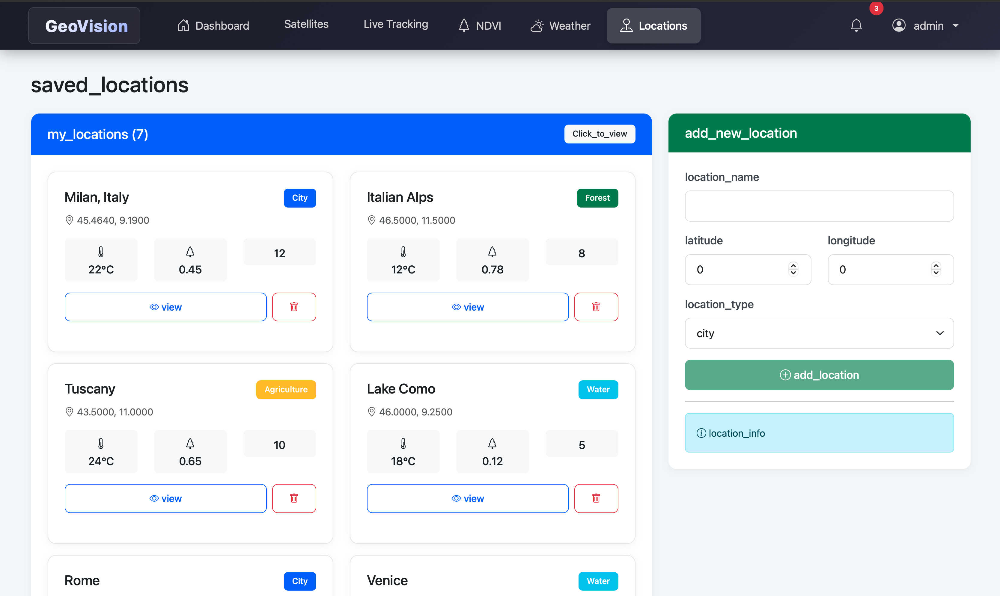

# 🌍 GeoVision Dashboard

[](https://angular.io/)
[](https://fastapi.tiangolo.com/)
[](https://python.org)
[](https://sqlite.org/)
[](https://leafletjs.com/)
[](https://render.com/)
[](LICENSE)

<div align="center">
  
  <p><em>A comprehensive Earth Observation and Remote Sensing Dashboard for satellite tracking, vegetation analysis, and weather monitoring</em></p>
</div>

## 📋 **Table of Contents**
- [🚀 Live Demo](#-live-demo)
- [🔭 Overview](#-overview)
- [✨ Features](#-features)
- [🛠️ Tech Stack](#️-tech-stack)
- [🏗️ Architecture](#️-architecture)
- [📋 Prerequisites](#-prerequisites)
- [🔧 Installation](#-installation)
- [🚀 Usage](#-usage)
- [📚 API Documentation](#-api-documentation)
- [🚢 Deployment](#-deployment)
- [📸 Screenshots](#-screenshots)
- [🤝 Contributing](#-contributing)
- [📄 License](#-license)
- [📞 Contact](#-contact)

---

## 🚀 **Live Demo**

The application is live and accessible at:

- **Frontend Application**: [https://geovision-frontend-ikof.onrender.com](https://geovision-frontend-ikof.onrender.com)
- **Backend API**: [https://geovision-backend.onrender.com](https://geovision-backend.onrender.com)
- **API Documentation**: [https://geovision-backend.onrender.com/docs](https://geovision-backend.onrender.com/docs)

**Demo Credentials:**
- **Username**: `admin`
- **Password**: `admin123`

> ⚠️ **Note**: The free tier services may spin down after periods of inactivity. The first request after inactivity might take 30-60 seconds to wake up.

---

## 🔭 **Overview**

GeoVision Dashboard is a powerful full-stack web application designed for Earth Observation enthusiasts, researchers, and professionals. It provides real-time access to satellite data, vegetation health indices (NDVI), weather patterns, and geographic location management through an intuitive and responsive interface.

Built with modern technologies, this platform serves as a comprehensive tool for monitoring our planet from space, analyzing environmental changes, and making data-driven decisions.

---

## ✨ **Features**

### 🛰️ **Satellite Tracking System**
- **Real-time Positioning**: Track satellites including ISS, Sentinel, Landsat, and NOAA in real-time
- **Pass Predictions**: Calculate and display upcoming satellite passes for any location
- **Interactive Maps**: Visualize satellite orbits and positions on an interactive world map
- **Satellite Catalog**: Comprehensive database with orbital parameters and metadata

### 🌿 **NDVI Analysis Module**
- **Vegetation Health Monitoring**: Calculate and visualize NDVI (Normalized Difference Vegetation Index)
- **Color-coded Visualization**: Intuitive color mapping from dense vegetation (green) to barren land (brown)
- **Time Series Analysis**: Track vegetation changes over time with historical data
- **Regional Statistics**: Generate statistics for specific geographic areas

### ☁️ **Weather Intelligence**
- **Current Conditions**: Real-time weather data including temperature, humidity, and wind speed
- **5-Day Forecast**: Extended weather predictions with hourly breakdowns
- **Weather Maps**: Interactive precipitation and temperature maps
- **Location Search**: Search weather by city name or geographic coordinates

### 📍 **Location Management**
- **Save Favorites**: Store and manage frequently accessed locations
- **Quick Access**: One-click access to satellite passes, NDVI, and weather for saved locations
- **Geocoding**: Convert addresses to coordinates and vice versa
- **Bulk Operations**: Import/export location data

### 🔐 **User System**
- **Secure Authentication**: JWT-based authentication with role-based access control
- **User Profiles**: Personalized dashboards and saved preferences
- **Session Management**: Automatic token refresh and secure logout

---

## 🛠️ **Tech Stack**

### **Frontend**
| Technology | Version | Purpose |
|------------|---------|---------|
| Angular | 19.2.1 | Core framework |
| Bootstrap 5 | 5.3 | UI components and styling |
| Leaflet | 1.9 | Interactive maps |
| Chart.js | 4.4 | Data visualization |
| ng2-charts | 6.0 | Angular wrapper for Chart.js |
| RxJS | 7.8 | Reactive programming |
| TypeScript | 5.4 | Type-safe JavaScript |

### **Backend**
| Technology | Version | Purpose |
|------------|---------|---------|
| FastAPI | 0.104.1 | Web framework |
| Python | 3.9+ | Programming language |
| SQLAlchemy | 2.0 | ORM for database operations |
| Pydantic | 2.5 | Data validation |
| JWT | 2.8 | Authentication |
| Passlib | 1.7 | Password hashing |
| Uvicorn | 0.24 | ASGI server |

### **Database & Infrastructure**
| Component | Technology | Purpose |
|-----------|------------|---------|
| Database | SQLite/PostgreSQL | Data persistence |
| Migrations | Alembic | Database version control |
| Hosting | Render | Frontend & backend deployment |
| Version Control | Git/GitHub | Source code management |

---

## 🏗️ **Architecture**

```
┌─────────────────────────────────────────────────────────────┐
│                      Client Browser                          │
└───────────────────┬─────────────────────────────────────────┘
                    │
                    ▼
┌─────────────────────────────────────────────────────────────┐
│                    Angular Frontend                          │
│  ┌─────────────┐  ┌─────────────┐  ┌─────────────┐        │
│  │   Auth      │  │  Dashboard  │  │   Services  │        │
│  │   Module    │  │   Module    │  │   Layer     │        │
│  └─────────────┘  └─────────────┘  └─────────────┘        │
│                                                             │
│  ┌─────────────┐  ┌─────────────┐  ┌─────────────┐        │
│  │  Satellite  │  │    NDVI     │  │   Weather   │        │
│  │   Tracker   │  │   Viewer    │  │  Dashboard  │        │
│  └─────────────┘  └─────────────┘  └─────────────┘        │
└───────────────────┬─────────────────────────────────────────┘
                    │
                    ▼
┌─────────────────────────────────────────────────────────────┐
│                    FastAPI Backend                           │
│  ┌─────────────┐  ┌─────────────┐  ┌─────────────┐        │
│  │   Auth      │  │ Satellites  │  │   Indices   │        │
│  │   Routes    │  │   Routes    │  │   Routes    │        │
│  └─────────────┘  └─────────────┘  └─────────────┘        │
│                                                             │
│  ┌─────────────┐  ┌─────────────┐  ┌─────────────┐        │
│  │   Weather   │  │ Geospatial  │  │   Location  │        │
│  │   Routes    │  │   Utils     │  │   Routes    │        │
│  └─────────────┘  └─────────────┘  └─────────────┘        │
└───────────────────┬─────────────────────────────────────────┘
                    │
                    ▼
┌─────────────────────────────────────────────────────────────┐
│                        Database                              │
│                  (SQLite/PostgreSQL)                         │
└─────────────────────────────────────────────────────────────┘
```

---

## 📋 **Prerequisites**

Before you begin, ensure you have the following installed:
- **Node.js** (v18 or higher) - [Download](https://nodejs.org/)
- **npm** (v9 or higher) - Comes with Node.js
- **Python** (v3.9 or higher) - [Download](https://python.org/)
- **Angular CLI** (v17 or higher) - `npm install -g @angular/cli`
- **Git** - [Download](https://git-scm.com/)
- **Code Editor** - VS Code recommended

---

## 🔧 **Installation**

### **1. Clone the Repository**
```bash
git clone https://github.com/zafariabbas68/GeoVision_Dashboard.git
cd GeoVision_Dashboard
```

### **2. Backend Setup**
```bash
# Navigate to backend directory
cd backend

# Create virtual environment
python -m venv venv

# Activate virtual environment
# On macOS/Linux:
source venv/bin/activate
# On Windows:
# venv\Scripts\activate

# Install dependencies
pip install -r requirements.txt

# Create environment configuration file
cat > .env << EOF
DATABASE_URL=sqlite:///./geovision.db
SECRET_KEY=your-super-secret-key-change-this-in-production
ACCESS_TOKEN_EXPIRE_MINUTES=30
OPENWEATHER_API_KEY=your-openweather-api-key  # Optional, for weather data
EOF

# Initialize the database
python -c "from app.database import Base, engine; Base.metadata.create_all(bind=engine)"

# Start the backend server
uvicorn app.main:app --reload --host 0.0.0.0 --port 8000
```

### **3. Frontend Setup**
```bash
# Open a new terminal window
cd frontend

# Install dependencies
npm install

# Configure environment
cat > src/environments/environment.ts << EOF
export const environment = {
  production: false,
  apiUrl: 'http://localhost:8000/api'
};
EOF

# Start the development server
ng serve --open
```

### **4. Access the Application**
- **Frontend**: http://localhost:4200
- **Backend API**: http://localhost:8000
- **API Documentation**: http://localhost:8000/docs
- **Alternative API Docs**: http://localhost:8000/redoc

---

## 🚀 **Usage**

### **Default Login Credentials**
After first setup, you can use these credentials:
- **Username**: `admin`
- **Password**: `admin123`

### **Quick Start Guide**

1. **Explore the Dashboard**
   - View system statistics and quick actions
   - Access all modules from the navigation bar

2. **Track Satellites**
   - Go to "Satellite Tracker" from the menu
   - Select a satellite from the dropdown
   - Click on the map to get pass predictions
   - View orbital parameters and real-time position

3. **Analyze Vegetation**
   - Navigate to "NDVI Viewer"
   - Enter a location or select from saved locations
   - Adjust date range for time series analysis
   - Download NDVI maps and statistics

4. **Check Weather**
   - Visit "Weather Dashboard"
   - Search for any city worldwide
   - View current conditions and 5-day forecast
   - Explore interactive weather maps

5. **Manage Locations**
   - Go to "Saved Locations"
   - Add new locations with custom names
   - Organize locations into categories
   - Quick access to all location-based features

---

## 📚 **API Documentation**

### **Authentication Endpoints**
| Method | Endpoint | Description | Request Body |
|--------|----------|-------------|--------------|
| POST | `/api/auth/register` | Register new user | `{username, email, password}` |
| POST | `/api/auth/login` | User login | `{username, password}` |
| GET | `/api/auth/me` | Get current user | - |

### **Satellite Endpoints**
| Method | Endpoint | Description | Parameters |
|--------|----------|-------------|------------|
| GET | `/api/satellites` | Get all satellites | - |
| GET | `/api/satellites/{id}` | Get satellite by ID | `id` |
| GET | `/api/satellites/passes/{lat}/{lon}` | Get satellite passes | `lat, lon, days?` |

### **NDVI Endpoints**
| Method | Endpoint | Description | Parameters |
|--------|----------|-------------|------------|
| GET | `/api/ndvi/{location}` | Get NDVI for location | `location` |
| GET | `/api/ndvi/historical/{lat}/{lon}` | Historical NDVI data | `lat, lon, start_date?, end_date?` |

### **Weather Endpoints**
| Method | Endpoint | Description | Parameters |
|--------|----------|-------------|------------|
| GET | `/api/weather/current/{city}` | Current weather | `city` |
| GET | `/api/weather/forecast/{city}` | 5-day forecast | `city` |

### **Location Endpoints**
| Method | Endpoint | Description | Request Body |
|--------|----------|-------------|--------------|
| GET | `/api/locations` | Get saved locations | - |
| POST | `/api/locations` | Save new location | `{name, lat, lon}` |
| PUT | `/api/locations/{id}` | Update location | `{name, lat, lon}` |
| DELETE | `/api/locations/{id}` | Delete location | - |

---

## 🚢 **Deployment**

### **Frontend Deployment on Render**

The frontend is deployed as a static site on Render:

1. **Connect Repository**: Link your GitHub repository to Render
2. **Configuration**:
   - **Build Command**: `cd frontend && npm install && npm run build`
   - **Publish Directory**: `frontend/dist/geovision-dashboard`
   - **Node Version**: 18+

3. **Environment Variables**:
   - `NODE_VERSION`: 18.18.0

### **Backend Deployment on Render**

The backend is deployed as a web service on Render:

1. **Configuration**:
   - **Build Command**: `pip install -r requirements.txt`
   - **Start Command**: `uvicorn app.main:app --host 0.0.0.0 --port $PORT`

2. **Environment Variables**:
   - `PYTHON_VERSION`: 3.11.9
   - `DATABASE_URL`: (Production database URL)
   - `SECRET_KEY`: (Your secret key)
   - `OPENWEATHER_API_KEY`: (Optional, for weather data)

### **Live URLs**
- **Frontend**: [https://geovision-frontend-ikof.onrender.com](https://geovision-frontend-ikof.onrender.com)
- **Backend API**: [https://geovision-backend.onrender.com](https://geovision-backend.onrender.com)
- **API Documentation**: [https://geovision-backend.onrender.com/docs](https://geovision-backend.onrender.com/docs)

---

## 📸 **Screenshots**

<div align="center">
  <h3>Main Dashboard</h3>
  
  <p><em>Overview dashboard with key metrics and quick access to all features</em></p>
  
  <br>
  <hr>
  <br>
  
  <h3>Satellite Tracking Interface</h3>
  
  <p><em>Real-time satellite tracking with pass predictions and orbital parameters</em></p>
  
  <br>
  <hr>
  <br>
  
  <h3>Live Satellite Tracking</h3>
  
  <p><em>Interactive map showing real-time satellite positions and trajectories</em></p>
  
  <br>
  <hr>
  <br>
  
  <h3>NDVI Analysis Visualization</h3>
  
  <p><em>Vegetation health index visualization with color-coded mapping from dense vegetation (green) to barren land (brown)</em></p>
  
  <br>
  <hr>
  <br>
  
  <h3>Weather Dashboard</h3>
  
  <p><em>Comprehensive weather data with current conditions and 5-day forecasts</em></p>
  
  <br>
  <hr>
  <br>
  
  <h3>Detailed Weather Information</h3>
  
  <p><em>Detailed weather information including temperature, humidity, wind speed, and atmospheric pressure</em></p>
  
  <br>
  <hr>
  <br>
  
  <h3>Saved Locations Management</h3>
  
  <p><em>Manage and access your favorite locations for quick satellite, NDVI, and weather analysis</em></p>
</div>

### **Screenshot Gallery (Compact View)**

<div align="center">
  <table>
    <tr>
      <td align="center"><b>Main Dashboard</b></td>
      <td align="center"><b>Satellite Tracker</b></td>
    </tr>
    <tr>
      <td></td>
      <td></td>
    </tr>
    <tr>
      <td align="center"><b>Live Tracking</b></td>
      <td align="center"><b>NDVI Analysis</b></td>
    </tr>
    <tr>
      <td></td>
      <td></td>
    </tr>
    <tr>
      <td align="center"><b>Weather Dashboard</b></td>
      <td align="center"><b>Weather Details</b></td>
    </tr>
    <tr>
      <td></td>
      <td></td>
    </tr>
    <tr>
      <td align="center" colspan="2"><b>Saved Locations</b></td>
    </tr>
    <tr>
      <td colspan="2" align="center"></td>
    </tr>
  </table>
</div>

---

## 🤝 **Contributing**

Contributions are what make the open-source community such an amazing place to learn, inspire, and create. Any contributions you make are **greatly appreciated**.

### **Contribution Guidelines**

1. **Fork the Project**
   ```bash
   git clone https://github.com/your-username/GeoVision_Dashboard.git
   cd GeoVision_Dashboard
   ```

2. **Create Your Feature Branch**
   ```bash
   git checkout -b feature/AmazingFeature
   ```

3. **Commit Your Changes**
   ```bash
   git commit -m 'Add some AmazingFeature'
   ```

4. **Push to the Branch**
   ```bash
   git push origin feature/AmazingFeature
   ```

5. **Open a Pull Request**

### **Development Guidelines**
- Follow existing code style and conventions
- Write meaningful commit messages
- Update documentation for new features
- Add tests for new functionality
- Ensure all tests pass before submitting PR

---

## 📄 **License**

This project is licensed under the MIT License - see the [LICENSE](LICENSE) file for details.

```
MIT License

Copyright (c) 2025 Ghulam Abbas Zafari

Permission is hereby granted, free of charge, to any person obtaining a copy
of this software and associated documentation files...
```

---

## 📞 **Contact**

**Ghulam Abbas Zafari**
- 🎓 **Politecnico di Milano** - Geoinformatics Engineering
- 📧 **Email**: [ghulamabbas.zafari@mail.polimi.it](mailto:ghulamabbas.zafari@mail.polimi.it)
- 💻 **GitHub**: [@zafariabbas68](https://github.com/zafariabbas68)
- 🔗 **LinkedIn**: [Ghulam Abbas Zafari](https://linkedin.com/in/ghulam-abbas-zafari)
- 🌐 **Portfolio**: [Personal Website](https://personal-website-gaz.onrender.com)

### **Project Links**
- **Repository**: [https://github.com/zafariabbas68/GeoVision_Dashboard](https://github.com/zafariabbas68/GeoVision_Dashboard)
- **Live Demo**: [https://geovision-frontend-ikof.onrender.com](https://geovision-frontend-ikof.onrender.com)
- **Backend API**: [https://geovision-backend.onrender.com](https://geovision-backend.onrender.com)
- **API Documentation**: [https://geovision-backend.onrender.com/docs](https://geovision-backend.onrender.com/docs)
- **Issue Tracker**: [GitHub Issues](https://github.com/zafariabbas68/GeoVision_Dashboard/issues)

---

## 🙏 **Acknowledgments**

- **Angular Team** for the incredible frontend framework
- **FastAPI Developers** for the high-performance Python framework
- **Render** for providing free hosting services
- **Leaflet Contributors** for the open-source mapping library
- **NASA** for satellite data APIs and public datasets
- **OpenStreetMap** for free map data and tiles
- **OpenWeatherMap** for weather data APIs
- **Politecnico di Milano** for academic support and resources

---

## ⭐ **Support**

If you find this project helpful, please consider:
- Giving it a ⭐ on GitHub
- Sharing it with others
- Contributing to its development
- Reporting bugs or suggesting features

---

<div align="center">
  <sub>Built with ❤️ by Ghulam Abbas Zafari for the Earth Observation Community</sub>
  <br>
  <sub>© 2025 GeoVision Dashboard. All rights reserved.</sub>
</div>


